# 🌊 HabitFlow — Premium Habit Tracker

<p align="center">
  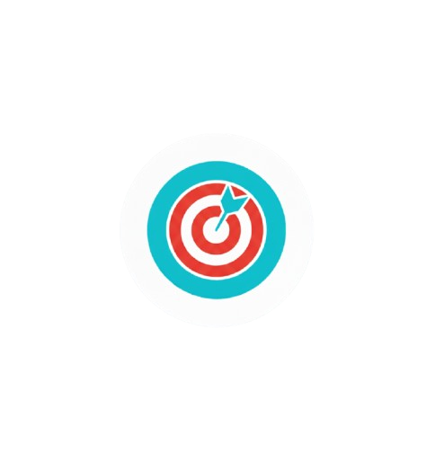
</p>

<p align="center">
  <b>A sleek, feature-rich, and premium Flutter habit tracker designed to help users build consistency, visualize progress with beautiful real-time analytics, and stay motivated.</b>
</p>

<p align="center">
  <a href="https://flutter.dev"></a>
  <a href="https://firebase.google.com"></a>
  
  
</p>

---

## 📱 Visual Showcase

Explore HabitFlow's highly polished, modern interface. All screenshots below are captured directly from the live application running with real-time Firebase syncing.

### 🔑 Core Screens & Workflows

<table align="center">
  <!-- ROW 1: Onboarding & Auth -->
  <tr>
    <td align="center" colspan="3"><b>🔑 Authentication & Navigation</b></td>
  </tr>
  <tr>
    <td align="center" width="33%">
      <b>🔐 Login Screen</b><br/>
      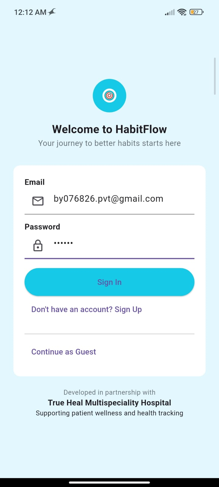
      <br/><em>Secure accounts portal.</em>
    </td>
    <td align="center" width="33%">
      <b>📝 Register Screen</b><br/>
      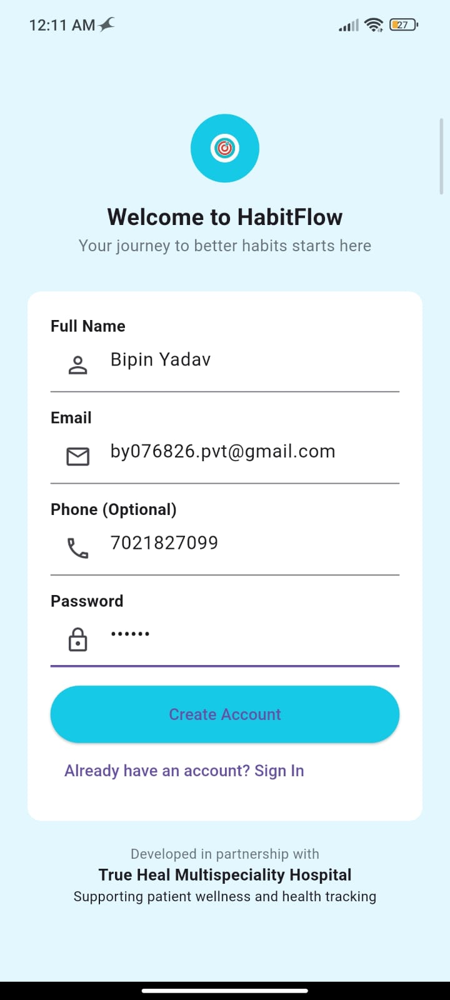
      <br/><em>New user onboarding setup.</em>
    </td>
    <td align="center" width="33%">
      <b>🧭 Navigation Drawer / More</b><br/>
      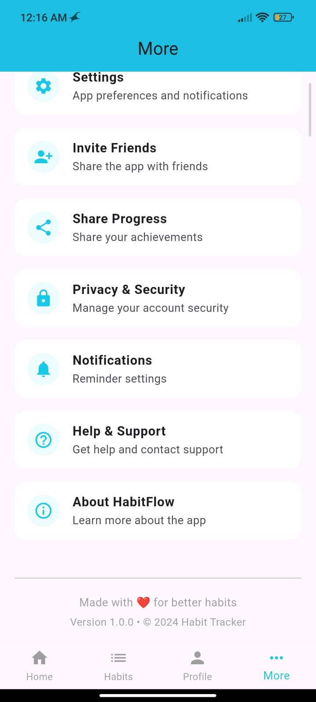
      <br/><em>Advanced utilities navigation.</em>
    </td>
  </tr>

  <!-- ROW 2: Habits Tracking -->
  <tr>
    <td align="center" colspan="3"><b>⚡ Habit Tracking & Progress</b></td>
  </tr>
  <tr>
    <td align="center" width="33%">
      <b>📊 Daily Dashboard</b><br/>
      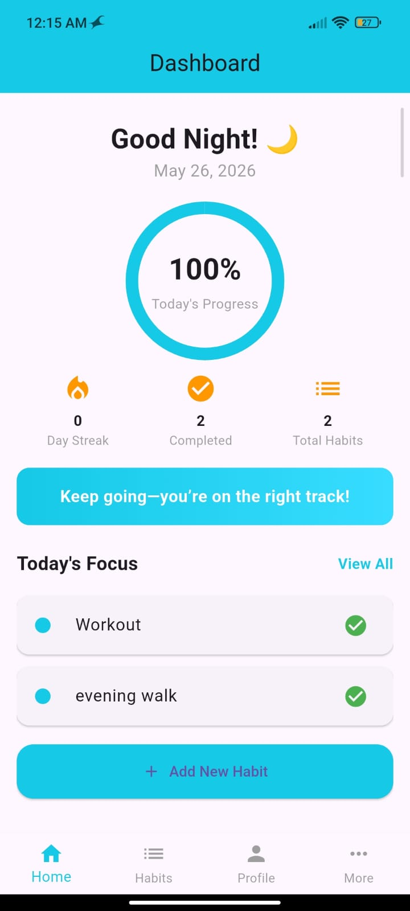
      <br/><em>Progress tracker & active checklist.</em>
    </td>
    <td align="center" width="33%">
      <b>➕ Add Habit</b><br/>
      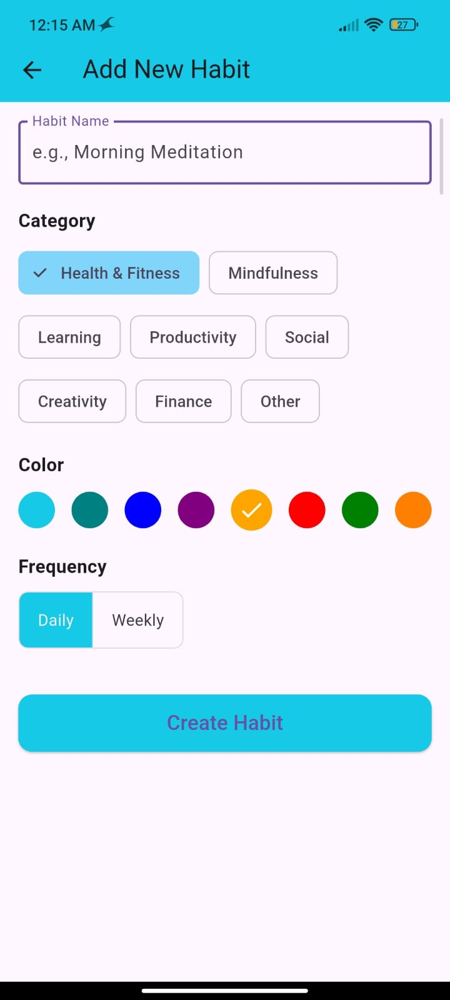
      <br/><em>Custom categories, color coding & frequency.</em>
    </td>
    <td align="center" width="33%">
      <b>📤 Progress Sharing</b><br/>
      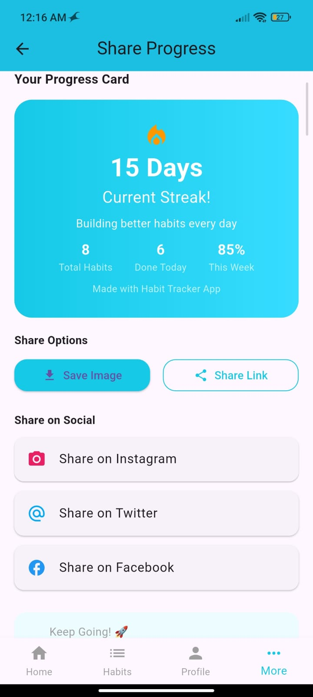
      <br/><em>High-vibrancy exportable achievement card.</em>
    </td>
  </tr>

  <!-- ROW 3: Profiles & Settings -->
  <tr>
    <td align="center" colspan="3"><b>⚙️ Profiles & Preferences</b></td>
  </tr>
  <tr>
    <td align="center" width="33%">
      <b>👤 User Profile</b><br/>
      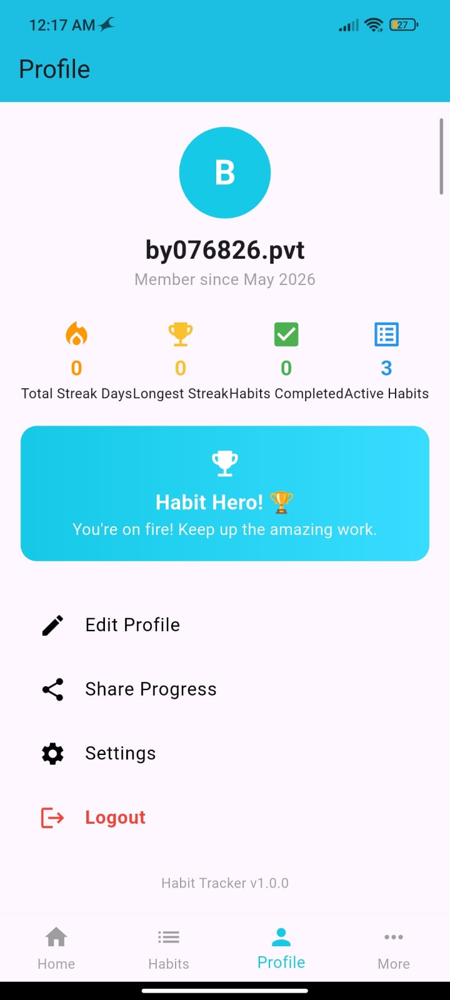
      <br/><em>Visual summary of achievements & stats.</em>
    </td>
    <td align="center" width="33%">
      <b>🔔 Notifications Reminders</b><br/>
      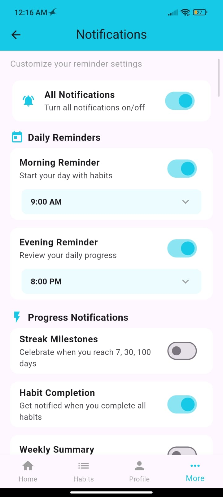
      <br/><em>Fine-grained morning/evening timer setups.</em>
    </td>
    <td align="center" width="33%">
      <b>⚙️ System Settings</b><br/>
      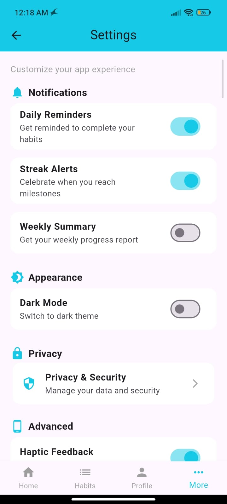
      <br/><em>Preferences and account management dashboard.</em>
    </td>
  </tr>

  <!-- ROW 4: Utilities & Info -->
  <tr>
    <td align="center" colspan="3"><b>💡 Utilities & Information</b></td>
  </tr>
  <tr>
    <td align="center" width="33%">
      <b>🔒 Privacy & Security</b><br/>
      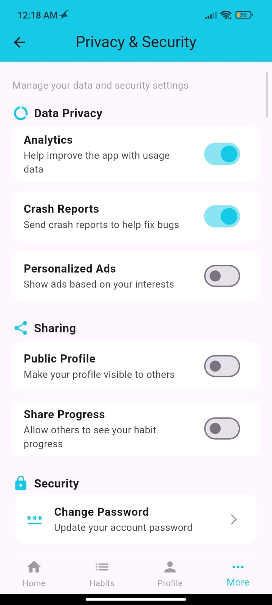
      <br/><em>Comprehensive data safety guidelines.</em>
    </td>
    <td align="center" width="33%">
      <b>✉️ Invite Friends</b><br/>
      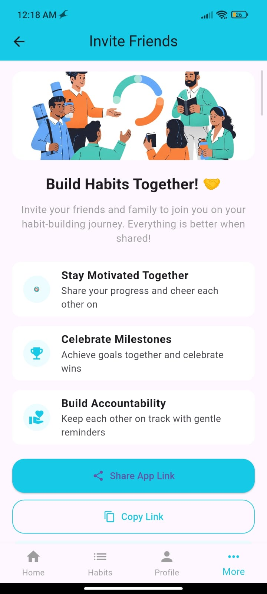
      <br/><em>Referral templates & social invites.</em>
    </td>
    <td align="center" width="33%">
      <b>ℹ️ About HabitFlow</b><br/>
      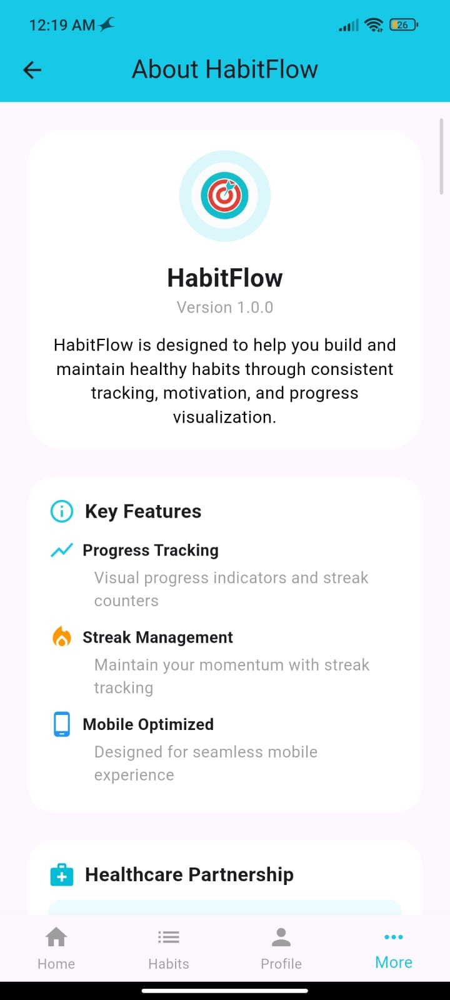
      <br/><em>Version detail and release log.</em>
    </td>
  </tr>
</table>

---

## ✨ Features

HabitFlow combines gorgeous aesthetics with powerful productivity tools:

*   **🔒 Secure Cloud Integration**: Powered by **Firebase Authentication** and **Cloud Firestore** for instant, secure real-time syncing across all devices.
*   **🌅 Dynamic Greeting & Quotes**: A dashboard that greets you based on the time of day, displaying high-vibrancy gradients and custom motivational quotes to start your day.
*   **📊 Interactive Progress Indicators**: Visual progress indicators (such as the circular dashboard tracker) showing the percentage of habits completed today.
*   **⚡ Modern Swipe Operations**: Fully integrated with `flutter_slidable`. Swipe right to mark a habit as completed/undone, or swipe left to edit/delete in an instant.
*   **📈 Detail Analytics & Streak Engine**: Track your current streaks, best historical streaks, total completed counts, and frequency benchmarks per habit.
*   **📤 Progress Card Generator**: Capture and generate gorgeous gradient progress cards with key achievements to share on Instagram, Twitter, and other platforms.
*   **🔔 Ultra-customizable Reminders**: Configure individual morning/evening reminder times, and toggle streak milestones, encouraging words, and completion alerts.

---

## 🛠️ Tech Stack & Packages

Built with the modern Flutter ecosystem and clean architectural practices:

| Package | Purpose |
| :--- | :--- |
| **`flutter`** | Core mobile framework providing rich Material Design UI elements |
| **`firebase_core` & `firebase_auth`** | Secure user registration, sign-in flows, and credentials management |
| **`cloud_firestore`** | Cloud-based, real-time database sync for instant habit caching and persistence |
| **`provider`** | State management keeping widgets reactive and synchronized |
| **`flutter_slidable`** | Clean swipe gesture recognition and animation layout |
| **`shared_preferences`** | Lightweight offline data caching for localized preferences |
| **`lucide_icons` & `cupertino_icons`** | High-fidelity vector iconography |
| **`share_plus` & `image_picker`** | Social media image export, camera picker, and native sharing protocols |
| **`flutter_native_splash`** | Instant, custom branded splash presentation |

---

## 📂 Project Architecture

The codebase is organized in a highly structured, scalable MVC-oriented layout:

```text
lib/
├── main.dart                 # App initialization, MaterialApp routes, and theme definition
├── firebase_options.dart     # Auto-generated Firebase configurations
├── models/
│   ├── habit.dart            # Habit schema, serialization mapping to Firestore
│   └── user.dart             # User profile structure
├── services/
│   ├── auth_service.dart     # Firebase auth queries (login, signup, password resets)
│   ├── habit_service.dart    # Firestore CRUDS for user-owned habits
│   └── notification_service.dart # Setting reminders and alarms
├── widgets/
│   ├── habit_tile.dart       # Custom card representing individual habits in a list
│   ├── main_navigation_bar.dart # Highly customized, sticky bottom navigation bar
│   └── progress_bar.dart     # Interactive visual loading progress
└── screens/
    ├── splash.dart           # Branded launcher splash animation
    ├── auth.dart             # Login & Registration views with smooth form validation
    ├── dashboard.dart        # Stats widgets, greetings, and active lists
    ├── habits.dart           # Sliding list representing active routines
    ├── add_habit.dart        # Setup form for title, frequency, colors, and notes
    ├── edit_habit.dart       # Form to modify current habit attributes
    ├── habit_detail.dart     # Statistics summary, week calendar view, and quick notes
    ├── profile.dart          # Key summary statistics (Total Streak, Habits Completed)
    ├── share_progress.dart   # Exporter UI for generating gradient progress sharing graphics
    ├── settings.dart         # Access profile options, notifications, and about info
    ├── notifications.dart    # Setup panel for fine-grained alert schedules
    ├── invite.dart           # Share invitations sheet
    ├── privacy.dart          # Content privacy details
    ├── about.dart            # Version history and credits
    └── help.dart             # General support FAQs and forms
```

---

## 🚀 Getting Started

Follow these steps to run the project locally on your machine.

### Prerequisites

*   Make sure you have the [Flutter SDK](https://docs.flutter.dev/get-started/install) (v3.0.0+) installed.
*   Setup a physical device or emulator/simulator (Android Studio, Xcode, or Web Browser).
*   Create a [Firebase Project](https://console.firebase.google.com/) for database and auth capabilities.

### 1. Clone the Repository

```bash
git clone https://github.com/bipinyada28/fresh_flow_habit.git
cd fresh_flow_habit
```

### 2. Configure Firebase

Use the [FlutterFire CLI](https://firebase.flutter.dev/docs/cli/) to configure your project automatically:

```bash
# Install the CLI if you haven't already
npm install -g firebase-tools
dart pub global activate flutterfire_cli

# Configure Firebase options for your project
flutterfire configure
```

This will automatically create a `firebase_options.dart` inside your `lib/` directory linked directly to your active firebase instances.

### 3. Install Dependencies

Fetch all referenced packages and modules:

```bash
flutter pub get
```

### 4. Build and Run

Run the app on your connected device:

```bash
flutter run
```

---

## 🗺️ Roadmap & Upcoming Features

- [ ] **📈 Advanced Graph Analytics**: Interactive weekly/monthly/yearly progress charts.
- [ ] **🌙 Dynamic Dark Theme**: Auto-adapting, modern dark mode palette supporting HSL colors.
- [ ] **🏆 Gamification & Milestones**: XP points, leveling up, and unlockable achievement badges.
- [ ] **💾 Offline Synchronization**: Local SQLite database cache for offline usage syncing to cloud when connection resumes.
- [ ] **📱 Desktop & Tablet UI**: Fully optimized layout architectures tailored for larger screen displays.

---

## 🤝 Contribution Guidelines

Contributions are welcome! Please follow these simple guidelines:

1.  **Fork** this repository.
2.  Create your feature branch (`git checkout -b feature/AmazingFeature`).
3.  Commit your changes (`git commit -m 'Add some AmazingFeature'`).
4.  Push to the branch (`git push origin feature/AmazingFeature`).
5.  Open a **Pull Request**.

---

<p align="center">
  Made with ❤️ by <a href="https://github.com/bipinyada28">Bipin Yadav</a>
</p>
